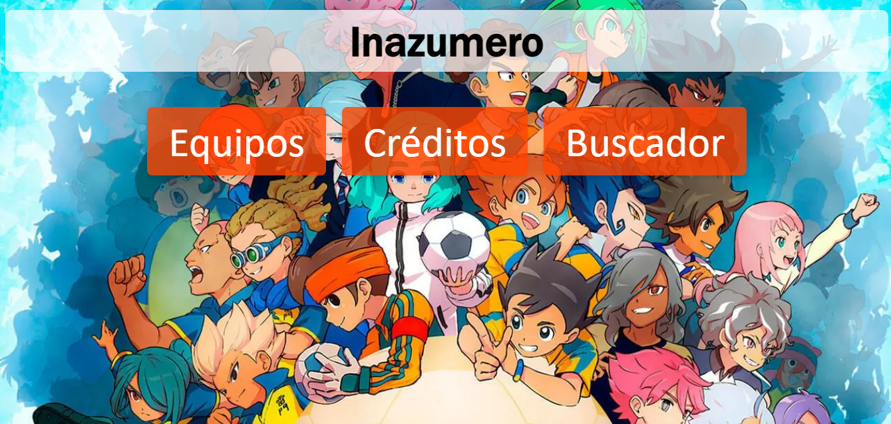
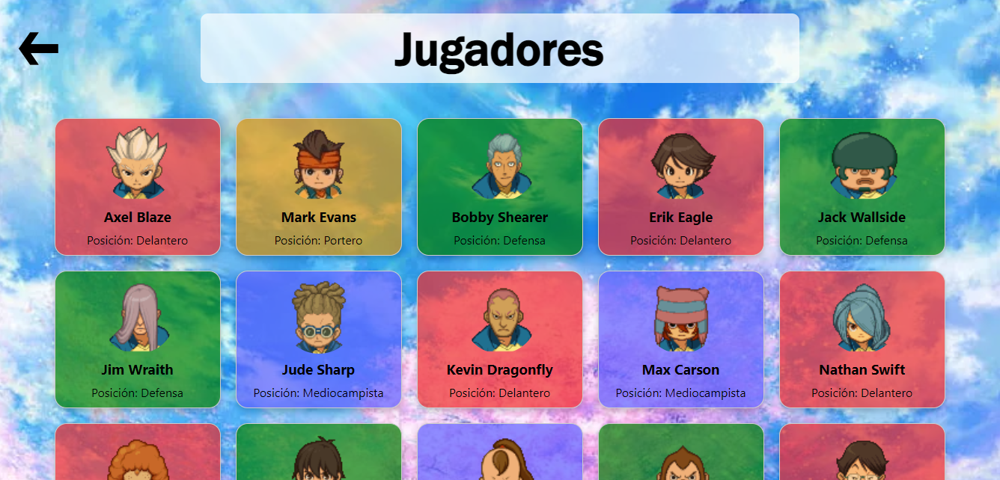

# Inazuma API



Este proyecto en español es una prueba de práctica para usar/hacer una API de **Inazuma Eleven**.

## Equipos


## Jugadores



## Activación de la API

Para activar la API, usa el siguiente comando:

```bash
uvicorn api.main:app --reload

